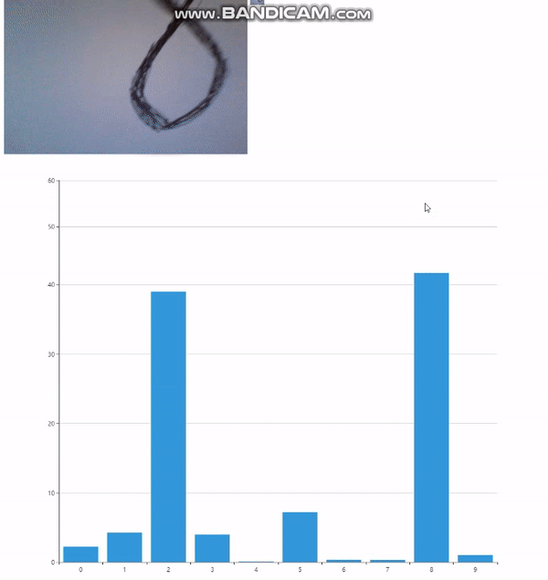

# mnistAppDemo
- 从零开始开发一款手写数字识别的app，作为AI app开发的demo
- 开发总耗时：9个小时
- 效果展示  

- 实际上手写数字识别并不适合使用摄像头作为进行识别的图像，因为受到光照的影响很大，但对于其他以图像识别为主的app，代码大同小异
## 可参考内容
- [https://github.com/tensorflow/tfjs-examples](https://github.com/tensorflow/tfjs-examples)，可以尝试把这里面的demo改成手机app
- [https://www.w3cschool.cn/tensorflowjs/](https://www.w3cschool.cn/tensorflowjs/)
## 主要技术栈
- 使用html5+js+HBuilderX开发基于网页的app，可一次开发，多次部署至网页，iOS，Android等多端
- webStorm作为IDE，HBuilderX在webStorm改动后可以检测到，无缝对接Android Studio，xcode等android，iOS app模拟调试工具
- 前端框架使用mui，尽可能接近h5，使用HBuilder可以直接创建mui的项目代码
- ai模型采用tensorflow/keras训练，tensorflowjs转成可用的模型
## 可选方案
1. 离线方案(模型训练权重+js前端)：使用Python+Tensorflow离线训练模型，使用Tensorflow.js将存储的模型权重载入，然后js提供从摄像头获取数据传入模型给出输出并展示的功能
2. 在线方案(python后端+js前端)：使用Python+Tensorflow训练模型，采用gRPC通信(亦可直接使用websocket+json)，js获取摄像头输出，传给python端的服务器，python后端调用模型处理，得到返回结果传回，然后前端展示

## 开发循环流程
在ide中写代码 -> HBuilderX：运行到浏览器(或安卓iOS模拟器) -> 刷新或者自动刷新查看结果 -> 回到ide
 
# 开发步骤：离线方案
大部分文档可见代码注释
## js部分(推荐windows上开发)
1. 完成摄像头图像流获取和显示
2. 间隔一段时间截取图像，按照python中对于mnist的预处理进行,包括归一化,灰度,reshape等
3. tensorflowJs载入python训练过后存储并导出的模型,步骤2的预处理后的图像作为输入进行模型预测，展示输出
### debug-模型载入
- 最大的bug是在tf.loadModel()里面，它只允许CORS请求，因此不能使用file路径，如果使用文件路径会因为找不到json文件而出错,解决方法是其一是不使用keras的loadModel，而是改成tf的模型，使用loadFrozenModel，参考：https://blog.csdn.net/zekdot/article/details/82913636，但是后来发现tf的converter已经更新，还是会转成同样的模型，所以只能尝试旧版的converter
- 但是实际上现有的tfjs很多教程都已经过期了，最新的tfjs不支持那些API，需要翻墙上官网js.tensorflow.org找新的API
- **最新的API调用是loadLayersModel，同样Python部分模型转换时的converter也是默认将keras转换成tfjs layers model，可以随意在https://github.com/tensorflow/tfjs-examples中找到一个示例文件，然后查看如何调用的api，load layers model是从indexeddb中读取！另外，load layers model可以使用localstorage://开头的url，可以尝试将本地文件存储到localstorage中再载入（使用indexdb亦可）**
- **一个可行的方案是，使用HBuilderX运行到浏览器时，会有"http://127.0.0.1:8848"可用，因此可以将路径设置为http://127.0.0.1:8848/app/python/tfjs_models/model.json**

## python部分(推荐linux上开发)
只测试在linux环境下使用python3.7+tf,tfjs模块完成模型训练和导出操作,windows下未测试(因需要tf-nightly)  
- 可以参考[https://www.w3cschool.cn/tensorflowjs/tensorflowjs-uc9p2q2m.html](https://www.w3cschool.cn/tensorflowjs/tensorflowjs-uc9p2q2m.html)来训练模型，保存到Tensorflow.js中然后js使用
- 目前暂时只训练手写数字识别  
1. 先正常训练模型  
2. tensorflow存储模型  
3. 使用tensorflowjs_converter转换(2,3步可以通过导入tensorflowjs来直接一步到位)  
### debug
- bug: cannot import name 'convert_to_constants' from 'tensorflow.python.framework',解决方法:pip instlal tf-nightly
 